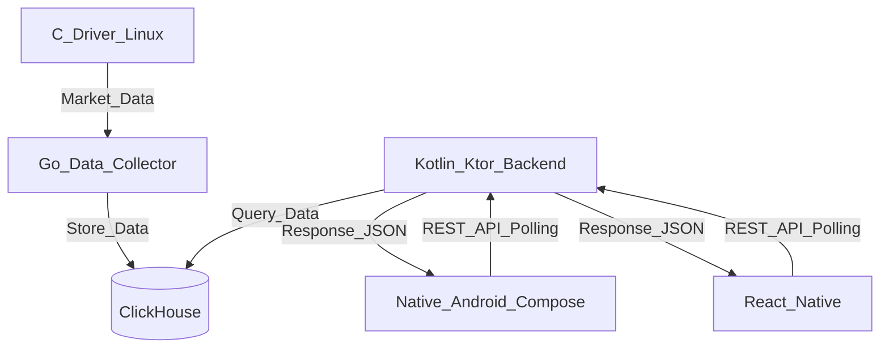

# Техническое задание: Разработка торгового терминала и брокерской системы

## 1. Введение и описание проекта

### 1.1 Цель проекта

Разработка программного обеспечения для брокерской системы и торгового терминала, состоящего из:

- Драйвер генерации рыночных данных на C (Linux)
- Сборщик и обработчик данных на Go
- База данных ClickHouse
- Бэкенд на Kotlin (ktor)
- Два идентичных по функционалу мобильных приложения на разных технологических стеках

### 1.2 Организация разработки

**Состав команды:**

Команда состоит из 4 разработчиков с распределением зон ответственности:

1. **Разработчик 1**

   - Драйвер на C (Linux)
   - Генерация рыночных данных
   - Сервис на Go

2. **Разработчик 2**

   - API на Kotlin \+ Ktor
   - Интеграция с ClickHouse
   - Настройка и работа с ClickHouse
   - Интеграция драйвера с базой данных

3. **Разработчик 3**

   - Native Android \+ Jetpack Compose приложение

4. **Разработчик 4**

   - React Native приложение

**Инструменты управления:**

- **Яндекс Трекер**: управление задачами, отслеживание прогресса, sprint planning
- **Яндекс Вики**: документация проекта, технические спецификации, knowledge base
- **Методология**: Kanban для гибкого управления потоком задач
  - Доска задач с колонками: Backlog, To Do, In Progress, Review, Done
  - Визуализация процесса разработки
  - Ограничение WIP (Work In Progress) для оптимизации потока

## 2. Технологический стек

### 2.1 Стек проекта

**Backend-слой:**

- **Драйвер рыночных данных**: C (Linux)

  - Генерация и эмуляция рыночных данных
  - Работа на Linux платформе

- **Сборщик данных**: Go

  - Получение данных от драйвера
  - Обработка и агрегация данных
  - Запись в базу данных

- **База данных**: ClickHouse

  - Хранение исторических данных
  - Аналитические запросы

- **API Backend**: Kotlin \+ Ktor

  - REST API для мобильных приложений
  - Polling для обновлений данных
  - Бизнес-логика торговых операций
  - Фреймворк: Ktor

**Mobile-слой:**

- **Приложение 1**: Native Android \+ Jetpack Compose
- **Приложение 2**: React Native

Оба мобильных приложения реализуют идентичный функционал на разных технологических стеках.

## 3. Архитектура системы

### 3.1 Общая схема взаимодействия

### 3.2 Компоненты системы

#### 3.2.1 Драйвер (C, Linux)

Генерирует рыночные данные для эмуляции работы биржи:

- Генерация котировок (цены инструментов)
- Эмуляция объемов торгов
- Симуляция поведения рынка
- Передача данных сборщику через сетевой протокол

#### 3.2.2 Сборщик данных (Go)

Промежуточный слой между драйвером и базой данных:

- Получение потока данных от драйвера
- Валидация входящих данных
- Агрегация данных (формирование свечей, статистики)
- Запись в ClickHouse

#### 3.2.3 База данных (ClickHouse)

Хранилище всех данных системы:

- Исторические котировки и свечи
- Данные о торгах пользователей
- Портфели и балансы
- Оптимизация для аналитических запросов

#### 3.2.4 Бэкенд (Kotlin \+ Ktor)

Основной сервер приложения:

- REST API для мобильных клиентов
- Polling endpoints для получения обновлений
- Обработка торговых операций (покупка/продажа)
- Управление пользователями и портфелями
- Аутентификация и авторизация

#### 3.2.5 Мобильные приложения

Два приложения с идентичным функционалом:

**Приложение 1 - Native Android \+ Jetpack Compose**

- Полностью нативная Android разработка
- UI на Jetpack Compose
- Kotlin для бизнес-логики клиента

**Приложение 2 - React Native**

- Кроссплатформенное решение
- JavaScript/TypeScript
- React компоненты

## 4. Функциональные требования

### 4.1 Управление портфелем и брокерскими счетами

Пользователь должен иметь возможность создавать и управлять своим инвестиционным портфелем через брокерские счета:

- **Отображение брокерских счетов**:

  - Баланс каждого счета
  - Валюта счета
  - Статус счета (активный, заблокированный)

- **Управление счетами**:

  - **Пополнение**: внесение средств на счет
  - **Вывод**: вывод средств со счета
  - **Перевод**: перевод средств между своими счетами
  - История операций по счету

- **Просмотр портфеля**: отображение всех активов, которыми владеет пользователь

- **Информация по активу**:

  - Количество единиц актива в портфеле
  - Средняя цена покупки
  - Текущая рыночная цена
  - Общая стоимость позиции
  - Прибыль/убыток по каждому активу
  - Процентное изменение стоимости

- **Общая статистика портфеля**:

  - Общая стоимость всех активов
  - Общий P&L портфеля
  - Распределение активов (диверсификация)
  - Доступный баланс для торговли

### 4.2 Торговые операции

Функционал для покупки и продажи финансовых инструментов:

- **Покупка активов**:

  - Выбор торгового инструмента
  - Указание количества для покупки
  - Расчет стоимости сделки с учетом комиссий
  - Подтверждение покупки
  - Добавление активов в портфель после исполнения

- **Продажа активов**:

  - Выбор актива из портфеля
  - Указание количества для продажи
  - Расчет выручки с учетом комиссий
  - Подтверждение продажи
  - Обновление портфеля после исполнения

- **Управление заявками**:

  - Просмотр активных заявок
  - Отмена неисполненных заявок
  - История всех заявок (исполненные, отмененные, отклоненные)

### 4.3 Мониторинг рынка

Инструменты для отслеживания состояния рынка и динамики цен:

- **Список инструментов**:

  - Каталог доступных для торговли активов
  - Поиск по названию/тикеру
  - Фильтрация по категориям
  - Сортировка (по цене, изменению, объему)
  - Добавление в избранное

- **График цены**:

  - Визуализация исторических данных цены
  - Свечной график (candlestick) с OHLC данными
  - Линейный график
  - Выбор таймфрейма (1 минута, 5 минут, 1 час, 1 день)
  - Автоматическое обновление через polling

- **Стакан заявок (Order Book)**:

  - Отображение текущих заявок на покупку (bids)
  - Отображение текущих заявок на продажу (asks)
  - Объемы на каждом уровне цены
  - Спред (разница между лучшей ценой покупки и продажи)
  - Обновление данных через polling

- **Детальная информация об инструменте**:

  - Текущая цена
  - Изменение цены за день (абсолютное и процентное)
  - Дневной диапазон цен (минимум/максимум)
  - Объем торгов за день
  - Описание актива

### 4.4 История торговли

Учет и анализ торговой активности пользователя:

- **История сделок**:

  - Список всех исполненных сделок
  - Фильтрация по инструменту, дате, типу операции
  - Детали сделки: дата/время, цена, количество, комиссия
  - Расчет P&L по каждой закрытой позиции

- **Аналитика**:

  - График изменения стоимости портфеля во времени
  - Статистика успешных/убыточных сделок
  - Общий P&L за выбранный период

### 4.5 Аналитика и прогнозирование

Инструменты для анализа портфеля и прогнозирования:

- **Графики динамики стоимости**:

  - График изменения общей стоимости портфеля во времени
  - График стоимости отдельных активов
  - Сравнение доходности разных активов
  - Выбор периода отображения (день, неделя, месяц, год, все время)
  - Визуализация исторической динамики

- **Баланс активов**:

  - Круговая диаграмма распределения активов в портфеле
  - Процентное соотношение каждого актива
  - Диверсификация по типам активов
  - Структура портфеля по валютам
  - Распределение средств по счетам

- **Прогнозы цены активов**:

  - Прогнозирование будущей цены на основе исторических данных
  - Визуализация трендов
  - Индикаторы технического анализа
  - Рекомендации по покупке/продаже на основе анализа
  - Оценка потенциального дохода/убытка

- **Статистика и отчеты**:

  - Общая доходность портфеля
  - Лучшие и худшие активы по доходности
  - Волатильность портфеля
  - Сравнение с рыночными индексами

### 4.6 Обновление данных

Механизм получения актуальных данных:

- **Polling-based обновления**:
  - Периодические запросы к API для получения свежих данных
  - Настраиваемая частота обновлений
  - Обновление цен, стакана, портфеля
  - Индикация последнего времени обновления

## 5. Архитектурные требования

### 5.1 Принципы проектирования

Архитектура должна быть гибкой и расширяемой:

- **Слабая связанность**: компоненты взаимодействуют через определенные интерфейсы
- **Модульность**: каждый компонент может разрабатываться и тестироваться независимо
- **Абстракции**: использование интерфейсов для ключевых компонентов
- **Масштабируемость**: возможность горизонтального масштабирования сервисов
- **Отказоустойчивость**: система должна корректно обрабатывать сбои отдельных компонентов

### 5.2 Взаимодействие компонентов

**Протоколы и форматы:**

- **C → Go**: TCP/UDP сокеты с бинарным протоколом или gRPC
- **Go → ClickHouse**: Нативный драйвер ClickHouse
- **Мобильные → Kotlin Backend (Ktor)**:
  - REST API для всех операций (JSON)
  - Polling для получения обновлений данных
- **Kotlin Backend → ClickHouse**: Нативный драйвер ClickHouse

### 5.3 Требования к производительности

- Обработка рыночных данных в real-time с минимальными задержками
- Эффективное получение обновлений через polling
- Поддержка множественных одновременных подключений клиентов
- Эффективное хранение и извлечение исторических данных

&nbsp;

• пользовательские данные в постгрес, а не кликхаус

• микросервисы обязательны

• видимо фичей слишком много накидали, Максу сраз расписать что конкретно надо

• операции: покупка, продажа

• история торговли нужна, минимальная, просто список всех операций и времени

• видимо надо ws, а не поллинг, но точного ответа он так и не дал, думаю можно и поллинг

• нужны боты для проверки 10к рпсов. Боты просто дергают ручки, на питоне