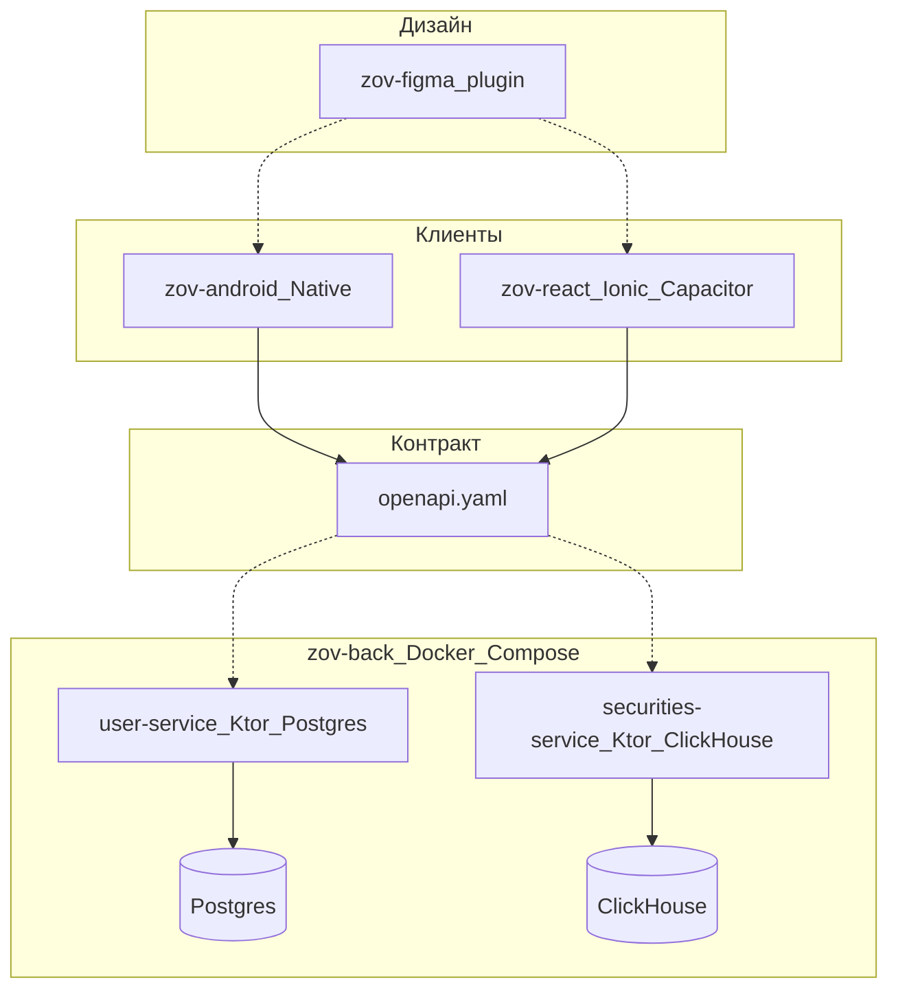

# ЗОВ денег

Мобильный брокерский терминал и бэкенд

ИТМО · РМП · презентация проекта

Апрель 2026

---
layout: default
---

# Цель проекта

- **Продукт:** торговля ценными бумагами, портфель, заявки, баланс, список отслеживания, история операций.
- **Контракт:** единый **OpenAPI 3** в корне репозитория — источник правды для клиентов и документации (**Swagger** на GitHub Pages при изменении `openapi.yaml`).
- **Организация кода:** один **Git-репозиторий** без submodule: согласованная эволюция API и клиентов.

<v-click>

По **ТЗ** полный стек включает также драйвер рыночных данных на **C**, сборщик на **Go**, **ClickHouse** как аналитическое хранилище котировок и **Ktor** как единый API-слой. В репозитории **уже реализованы** отдельные Ktor-сервисы под части домена, Docker Compose и нативный Android; часть компонентов ТЗ — **дорожная карта**.

</v-click>

---
layout: two-cols
layoutClass: gap-8
---

# Продукт — сценарии пользователя

::left::

- Регистрация и вход (**PIN**, refresh-токены, биометрия в спецификации).
- **Главная:** сводка портфеля.
- **Поиск и карточка бумаги:** котировки, история цен, стакан (для авторизованных).
- **Заявки** на покупку/продажу с учётом лота и лимитов баланса/позиций.
- **Баланс:** пополнение и вывод.
- **Список отслеживания** и **история транзакций**.

::right::

**Роли API** (`docs/roles.md`):

| Роль | Суть |
|------|------|
| `anonymous` | Публичные данные (список бумаг и т.п.) |
| `user` | Свой портфель, заявки, баланс |
| `admin` | Пользователи и справочник бумаг; без торгового счёта |

Админ **не торгует**; отдельные `/admin/*` сценарии в матрице доступа.

---
layout: center
class: text-center
---

# Архитектура репозитория

<v-click>

В ТЗ второй мобильный клиент описан как **React Native**; в монорепе фактически — **Ionic React + Capacitor** (`zov-react`), целевой тот же REST.

</v-click>

---
layout: default
---

# OpenAPI — договорённости

- **JWT Bearer:** access **15 мин**, refresh **30 дней** (как в описании `info` и user-service).
- **Деньги и цены** — **строки** с десятичной точкой (без потери точности на бэкенде).
- **Время** — **Unix timestamp в секундах** (UTC); интервалы истории цен — `from` / `to`.
- **Теги:** `auth`, `users`, `securities`, `portfolio`, `orders`, `transactions`, `balance`, `admin`.

Публикация: workflow **`deploy-swagger-pages.yml`** при изменении контракта.

---
layout: default
---

# Бэкенд: Docker Compose

Сеть **`zov-deneg-network`**, единая точка запуска — каталог **`zov-back/`**.

| Сервис | Порт (хост) | Назначение |
|--------|-------------|------------|
| **postgres** | 5432 | User Service, БД `userservice` |
| **clickhouse** | 8123 / 9000 | котировки, стакан, БД `securities` |
| **user-service** | **8080** | пользователи, JWT, профиль, админка пользователей |
| **securities-service** | **8081** | список бумаг, история цен, order book |

Конфигурация разбита на **`env/*.env`**; корневой `.env` задаёт маппинг портов.

---
layout: two-cols
layoutClass: gap-10
---

# user-service

::left::

- **Kotlin 2.x**, **Ktor 3.x**, **Exposed**, **PostgreSQL 15**.
- Регистрация/логин, **JWT** (java-jwt), BCrypt для секретов.
- Роли **user** / **admin**, управление профилем и списком пользователей (админ).

::right::

Makefile и Docker в README сервиса; интеграционные сценарии описаны в **`TESTING.md`**.

<v-click>

Сервис соответствует домену **`/auth/*`**, **`/users/*`**, части админских маршрутов из матрицы `roles.md`.

</v-click>

---
layout: two-cols
layoutClass: gap-10
---

# securities-service

::left::

- **Kotlin / Ktor**, данные в **ClickHouse**.
- Публичные и защищённые read-маршруты: список/детали бумаги, **история цен**, **стакан** (`depth`).
- Фильтры: тикер, тип, биржа, сектор, пагинация.

::right::

JWT **issuer/audience** отдельные от user-service; секреты через `env/`.

<v-click>

Соответствует тегу **`securities`** в OpenAPI; агрегация рыночных данных в перспективе стыкуется с пайплайном **C/Go** из ТЗ.

</v-click>

---
layout: default
---

# Android-клиент (`zov-android`)

| Слой | Технологии |
|------|------------|
| UI | **Jetpack Compose**, **Material 3**, Navigation Compose |
| Архитектура | Чистая архитектура: **ViewModel** → **use case** → **repository** |
| Сеть | **Ktor Client** (+ **MockEngine** для UI без сервера) |
| DI | **Hilt** |
| Асинхронность | **Coroutines** / **Flow** |

Источники: **`docs/android-stack.md`**, процесс **Figma → слои → OpenAPI** — **`android-development-process.md`**.

---
layout: default
---

# Качество и CI — Android

- **Detekt** (`detekt.yml`), задача из корня Gradle; **`check`** в `:app` зависит от **detekt**.
- **Pre-commit** в **`.githooks/`**: при изменениях под `zov-android/` — `./gradlew detekt` (один раз: `git config core.hooksPath .githooks`).
- **GitHub Actions:** на **`master`** при изменениях `zov-android/**` — только Detekt; ветка **`android-release`** — сборка **debug APK** в артефактах.

---
layout: default
---

# Дизайн: Figma-плагин (`zov-figma`)

- **Dev-плагин:** страницы **«Компоненты»** и **«Экраны»**, макеты **360×800** (Android Compact).
- Сборка: **`node zov-figma/build.mjs`** склеивает **`parts/`** → **`plugin/code.js`** и **`dist/screens.assembled.js`**.
- Порядок фрагментов задан массивом **`ORDER`** в `build.mjs` (константы → билдеры → экраны).
- Для **Figma MCP**: вставка собранного JS в вызов инструмента с `fileKey`.

Плагин при запуске **очищает** целевые страницы и пересобирает макеты.

---
layout: default
---

# Второй клиент: `zov-react`

Не React Native из ТЗ, а **Ionic React 8** + **Capacitor 8** + **Vite 5**.

- Маршрутизация **react-router** v5, состояние запросов **TanStack Query**.
- Уже есть поток **регистрации / PIN**, **логин**, заготовки табов — база для выравнивания с OpenAPI.

Цель: **тот же REST-контракт**, что у Android, с кросс-платформенной оболочкой.

---
layout: default
---

# Процесс и инфраструктура (ТЗ + репо)

- **Команда по ТЗ:** зоны C/Go, Ktor+ClickHouse, Android, React Native — в репо отражены **реальные** каталоги и стеки.
- **Управление:** Яндекс Трекер, Вики, **Kanban** (Backlog → Done, WIP-лимиты) — зафиксировано в ТЗ.
- **CI в корне:** Swagger Pages, Android Detekt/APK, отдельные **`ktor-build.yml`**, **`go-build.yml`** (под будущие/смежные артефакты пайплайна данных).

---
layout: center
class: text-center
---

# Итоги

- **Монорепозиторий** с контрактом **OpenAPI**, **двумя Ktor-сервисами**, **Postgres + ClickHouse**, **нативным Android** и **Ionic/Capacitor**.
- **Дизайн** воспроизводим плагином Figma из исходников в **`parts/`**.
- **Дорожная карта ТЗ:** драйвер C, Go-сборщик, полная склейка с единым Ktor API — поверх уже заложенной модели данных и клиентов.

## Q&A

Спасибо за внимание
