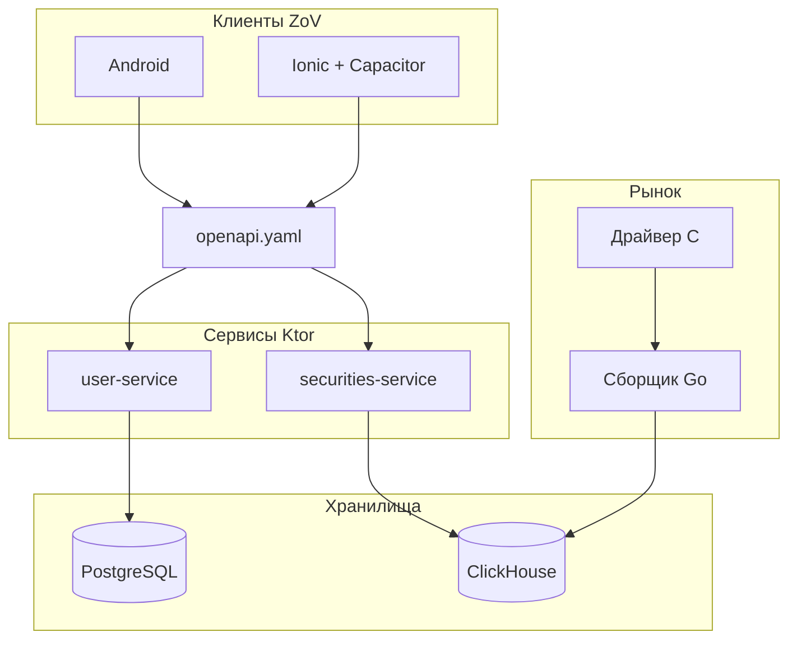
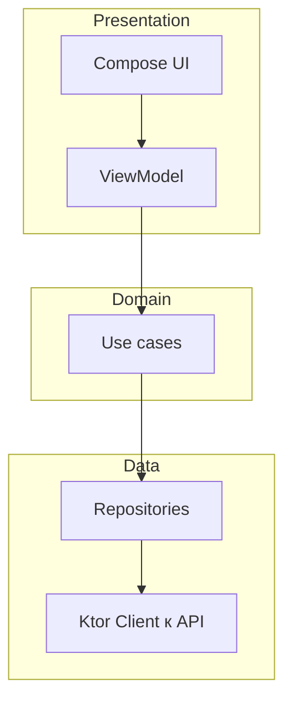
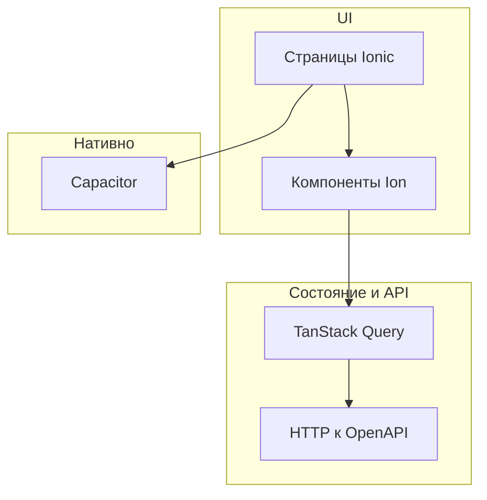

# ZoV денег

## Мобильный брокерский терминал и платформа

| Параметр | Значение |
|----------|----------|
| ВУЗ | ИТМО |
| Дисциплина | Разработка мобильных приложений |
| Команда | Рекалов Артём · Тараненко Максим · Кирячек Тимофей |

---
layout: default
---

# О чём проект

Проект **ZoV денег** — это **мобильное брокерское приложение** для частного инвестора: в одном продукте доступны котировки и карточки ценных бумаг, портфель, подача и отслеживание заявок, баланс брокерского счёта и история операций.

Мы делаем **два клиента** под **один договорённый сценарий**: нативное приложение под Android и кросс-платформенное приложение на веб-стеке с нативной оболочкой — чтобы пользователь получал **одинаковый опыт** независимо от выбранной платформы.

Документация для разработки и согласования между командами ведётся вокруг **единого описания API** и макетов интерфейса.

---
layout: two-cols
---

# Функциональность

::left::

**Пользователь видит и делает**

1. Регистрируется и входит по PIN, управляет профилем.
2. Смотрит рынок: список бумаг, поиск, карточку, график цен, стакан.
3. Выставляет и отменяет заявки на покупку и продажу.
4. Видит портфель и сводку по счёту, пополняет и выводит средства.
5. Ведёт список отслеживания и просматривает историю транзакций.

::right::

**Роли в продукте**

| Роль | Возможности |
|------|-------------|
| Гость | просмотр публичных данных по рынку |
| Клиент | торговля, свой портфель и счёт |
| Администратор | управление пользователями и справочником бумаг без торгового счёта |

---
layout: default
---

# Архитектура

Компактная схема: **меньше этажей по вертикали** — внутри блоков элементы в **одну строку** (`direction LR`).



---
layout: default
---

# Процесс разработки

| Практика | Как устроено у нас |
|----------|---------------------|
| Методология | **Kanban**: поток задач без жёстких спринт-циклов, ограничение WIP |
| Задачи | **Яндекс Трекер**: доска, статусы, ссылки на репозиторий и договорённости |
| Документация | **Яндекс Вики**: ТЗ, решения по API, заметки по интеграции и стендам |

Единый ритм: задача взята из бэклога → в работе → ревью → готово; прозрачность для всей тройки разработчиков.

---
layout: default
---

# Инфраструктура и инструменты

- **Монорепозиторий на GitHub** — один репозиторий для контракта, клиентов, бэкенда и плагина Figma; общая история и ревью.
- **CI на GitHub Actions** — при изменениях поднимаются проверки (в т.ч. Android, Ktor, Go), публикация **Swagger** из актуального **`openapi.yaml`**.
- **Docker Compose** — единый способ поднять Postgres, ClickHouse и сервисы API для разработки и демонстрации; конфигурация через **`env/`**.
- **OpenAPI** в корне репозитория — **единый источник правды** для клиентов; при merge в основную ветку артефакты документации обновляются автоматически.

---
layout: default
---

# Драйвер рыночных данных на языке C

- Низкоуровневый компонент под **Linux**: генерация и эмуляция потока рыночных данных.
- Даёт предсказуемый поток котировок и событий стакана для отладки и интеграции без внешних бирж.
- Отдаёт данные **сборщику на Go** для нормализации и записи в **ClickHouse**.

---
layout: default
---

# Сборщик и обработка на Go

```
Драйвер → приём → валидация → агрегация → запись в ClickHouse
```

- Один процесс отвечает за **устойчивый конвейер**: не терять пакеты, согласовать формат с драйвером и схемой в БД.
- После записи данные доступны **сервису ценных бумаг** для выдачи в API.

---
layout: two-cols
---

# ClickHouse

::left::

**Зачем в ZoV**

- временные ряды котировок и истории цен;
- данные стакана и аналитические запросы;
- масштаб по объёму событий.

::right::

**Как подключено**

| Что | Где |
|-----|-----|
| Сервис | `securities-service` |
| Доступ | HTTP / native порты в Compose |
| Конфиг | `env/` в каталоге бэкенда |

---
layout: default
---

# Ktor: что делает бэкенд

1. **user-service** — регистрация и вход, JWT-сессии, профиль, роли **user** / **admin**, администрирование пользователей по матрице доступа из `roles.md`.
2. **securities-service** — справочник ценных бумаг, фильтры и пагинация, **история цен** и **стакан** для карточки инструмента.
3. Общий для клиентов контракт — **`openapi.yaml`**: один источник правды для **Android** и **Ionic**; после изменений контракта **Swagger** обновляется в CI (GitHub Pages).

Сервисы поднимаются вместе с **Postgres** и **ClickHouse** через **Docker Compose** в каталоге `zov-back/`.

---
layout: default
---

# Ktor: стек технологий

| Слой | Технология |
|------|------------|
| Язык | Kotlin |
| HTTP | Ktor Server |
| Доступ к БД | Exposed |
| Пользователи и сессии | PostgreSQL, JWT (java-jwt), BCrypt |
| Рыночные данные | ClickHouse (HTTP / JDBC-клиент) |
| Сборка и контейнер | Gradle, Docker |

---
layout: default
---

# Figma: плагин дизайна ZoV

> Плагин собирает страницы **«Компоненты»** и **«Экраны»** в одном файле дизайна.

1. Исходники — каталог **`parts/`** (экраны по файлам, константы, билдеры).
2. Сборка — **`node zov-figma/build.mjs`** → готовый **`plugin/code.js`**.
3. Макеты под **360×800**, шрифт **Inter**, ориентация на Android Compact.
4. При каждом запуске плагин **очищает** целевые страницы и пересобирает макеты — без дублей.

---
layout: default
---

# Android: стек

| Назначение | Технология |
|------------|------------|
| UI | Jetpack Compose, Material 3 |
| Навигация | Navigation Compose |
| Архитектура | чистая архитектура (слои ниже) |
| Сеть | Ktor Client, при необходимости MockEngine |
| DI | Hilt |
| Асинхронность | Kotlin Coroutines, Flow |
| Качество | Detekt, pre-commit `.githooks/`, CI на `master`, APK на ветке `android-release` |

**Безопасность и данные на устройстве**

- **Вход по отпечатку / биометрии** — `BiometricPrompt`, согласование с API (`/auth/biometrics` в контракте): включение и проверка без передачи сырого биометрического шаблона на сервер.
- **PIN** — основной фактор после регистрации; биометрия как удобный второй фактор к локально сохранённой сессии.
- **Зашифрованное хранение** — чувствительные данные (токены refresh, флаги биометрии, настройки сессии) в **EncryptedSharedPreferences** и/или защищённом контейнере с опорой на **Android Keystore** (ключи не извлекаются в открытом виде).
- **Токены** — не кладём в обычный `SharedPreferences`; при необходимости краткоживущий access — в памяти процесса, refresh — только в зашифрованном хранилище.

---
layout: center
---

# Android: схема слоёв



---
layout: default
---

# Ionic и Capacitor: стек

| Назначение | Технология |
|------------|------------|
| UI | Ionic React, компоненты Ion, темизация |
| Рантайм | React 19, TypeScript |
| Сборка | Vite |
| Нативная оболочка | Capacitor (Android и др.) |
| Маршруты | React Router |
| Данные с сервера | TanStack Query |
| Формы / валидация | Formik, Zod |
| Доступ к нативным API | плагины Capacitor (Preferences, Status Bar и др.) |

Один кодовый базис веб + оболочка под магазины и тестовые сборки.

---
layout: center
---

# Ionic: схема слоёв



---
layout: default
---

# ИИ и инструменты в работе над ZoV

| Направление | Что использовали |
|-------------|------------------|
| Текст и код | **текстовые агенты**, **Cursor**, **Claude Code** |
| Документация и контракт | **Nessie** (версионирование и согласование артефактов API) |
| Контекст и автоматизация | **MCP** популярных сервисов, в том числе **Context7** (актуальная документация библиотек) |
| Дизайн | **MCP Figma** — работа с макетами и плагином из IDE |
| Эта презентация | **Claude Code** + **Slidev** |

Итоговые решения и ответственность за код и сценарии — у команды; ИИ — ускоритель и вторая пара глаз.

---
layout: default
---

# Деплой

| Компонент | Как выкладываем |
|-------------|-----------------|
| API и БД | Docker Compose из `zov-back/`, переменные `env/*.env` |
| Документация API | Swagger на GitHub Pages из `openapi.yaml` по CI |
| Android | Gradle; debug APK как артефакт CI на ветке `android-release` |
| Ionic | production build Vite; сборка Capacitor под устройство |
| Рынок C / Go | процессы на арендованном Linux-сервере, связь с ClickHouse |

---
layout: default
---

# Роли в команде

### Артём Рекалов

- менеджмент;
- макеты в Figma;
- контракт back ↔ mobile;
- приложение **Android**.

### Максим Тараненко

- сборщик **Go**;
- **ClickHouse**;
- бэкенд **Ktor**.

### Тимофей Кирячек

- драйвер **C**;
- клиент **Ionic + Capacitor**;
- аренда и настройка **сервера**.

---
layout: default
---

# Дорожная карта (1/2)

**Крайний срок:** последняя пара **30 апреля** — полная готовность.

| Неделя | Артём | Макс | Тимофей | Общий прогресс |
|--------|--------|------|---------|----------------|
| 23.03–29.03 | Старт макета; старт контракта back–mobile | — | — | Примерный макет и контракт |
| 30.03–05.04 | Завершение макета и контракта | Старт Ktor; обсуждение контракта драйвер ↔ Go | Старт драйвера; то же обсуждение | Готовы: макет, контракт back–mobile, контракт драйвер–Go. В работе: Ktor, драйвер |
| 06.04–12.04 | Старт нативного Android | Завершение Ktor | Завершение драйвера; старт Ionic | Готовы: Ktor, драйвер. В работе: Android, Ionic |

---
layout: default
---

# Дорожная карта (2/2)

| Неделя | Артём | Макс | Тимофей | Общий прогресс |
|--------|--------|------|---------|----------------|
| 13.04–19.04 | Завершение Android | Сборщик Go + ClickHouse | Разработка Ionic | Готовы: оба клиента, сборщик, ClickHouse |
| 20.04–26.04 | Тестирование | Деплой бэкенда и сборщика | Деплой драйвера; подключение сборщика | Всё готово; возможны баги |
| 27.04–30.04 | — | — | — | Полная готовность |

---
layout: center
class: text-center
---

# Демо

---
layout: center
class: text-center
---

# Спасибо за внимание

Вопросы?


*Монорепозиторий ZoV:* https://github.com/arekalov/zov-deneg
